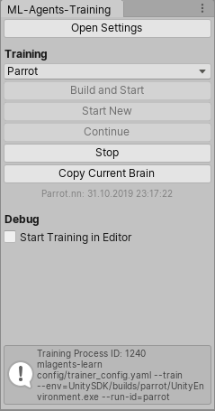

# ML Agents Helper

This package aims to make development with ML-Agents quicker and easier.

Features:
- Setup Training Configurations from Unity Project Settings
- Start, Stop, Continue Training from Unity Editor
- Easily copy trained Brains into your Project
- Set "Control" Parameter on Build-Time for Trainings Scenes
- Automatically Update Vector Observations during Development

## Content

### ML-Agents Settings Window

- Active: If true this configuration will be used for training in ML-Agents-Training Window
- Name: well...
- Run ID*: the run-id parameter
- ML-Agents Dir Rel*: Relative Path to your project to ML-Agents root directory
- Config Rel*: Relative Path from ML-Agents root to the yaml configuration file used for training
- Brain Names*: Local Asset Paths to the Brains to be trained, separated by ";"
- Executable Rel: (optional) Relative Path to the executable used for training, if none defined or not found training will run in the editor
- Anaconda Env: (optional) Name of your anaconda environment that will activate for training
- Curriculum Dir Rel: (optional) Relative Path from Ml-Agents root to the curriculum folder used for training

Detect Problems Button:
- Checks if json files in curriculum directory (if defined) match any Brain in your project
- Checks if added brains are LearningBrains (and exist)
 

Currrent Training Process ID: When starting traing from Training Window the Process ID is stored. This ID is used to find the previously started trainings process when UnityEditor recompiles scripts (e.g. when you work on your code while training)

### ML-Agents Training Window

Use this window to Start, Stop or Continue Training.

Copy Current Brain lets you copy the previously trained brain OR (if clicked during training) will temporarily Stop the training, copy the saved brain in your project and then resume training.

### Automatically Update Vector Observations
Import the "Training Editor Preprocessors" Samples from Unity Package Manager into your project. Then add the "Auto Update Observation" Script to any (or possibly all) of your Agents in your Training Scene. The script checks during ScriptReload (when writing Agent Code) all of your marked Agent's brains get updated. Internally it calls "InitializeAgent" and then "CollectVectorObservations" so make sure your Agent references are all set during Edit-Time.

### Training Scene Marker
Add this script to any GameObject in your scene to Automatically set your Academy "Control" to true when Building for Training.

